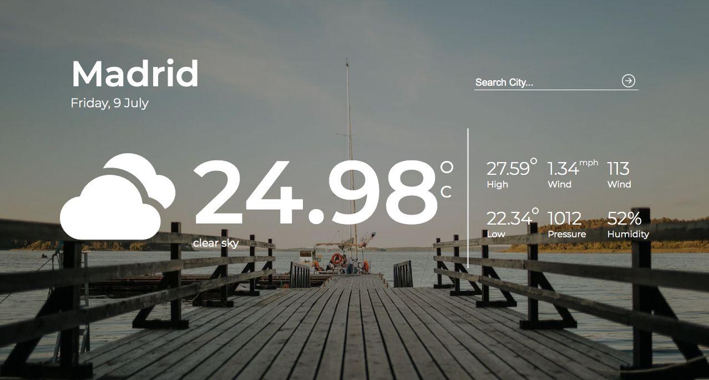
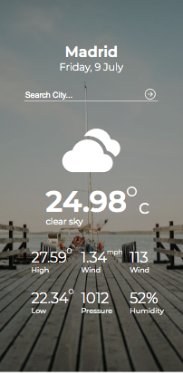

# Weather App

> The Weather App project comes at the end of the Asynchronous Javascript and APIs section of the Javascript course. It's a website that helps you know the weather conditions around the world.

This website was designed with the tools below:

## Built With

- Javascript
- CSS
- Webpack

## Getting Started

**To get the local copy of the project up and running you will need to run the following commands on your terminal:**

`git clone https://github.com/barackm/weather-app`

To install all the available dependecies run:
`npm install`

To bundle and transpile the javascript code using webpack run:
`npm run build` for production, or:
`npm run dev` for development.

Then `npm start`.

Now you can open up the index.html file (located in the dist directory in chrome) to see the result.

## Authors

👤 **Barack Mukelenga**

- GitHub: [@barackm](https://github.com/barackm)
- Twitter: [@BarackMukelenga](https://twitter.com/BarackMukelenga)
- LinkedIn: [Baraka Mukelenga](https://www.linkedin.com/in/baraka-mukelenga/)
- Portfolio: [Website](https://barackm.me)

## 🤝 Contributing

Contributions, issues, and feature requests are welcome!

Feel free to check the [issues page](https://github.com/barackm/weather-app/issues).

## Show your support

Give a ⭐️ if you like this project!❤️❤️❤️

## Acknowledgments

- Microverse)
